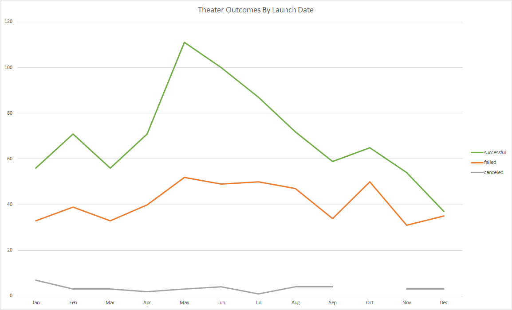

# kickstarter-analysis
Performing analysis on kickstarter data to uncover trends in campaign success.

## Overview of Project
Louise’s play *Fever* came close to its fundraising goal in a short amount of time. Now, she wants to know how different campaigns fared in relation to their launch dates and their funding goals.

## Cleaning Data
The main challenge with exploring this dataset was formating the **lanched_at variable**. In it's raw format, it is a ten digit timestamp that is difficult to understand. As it is the timestamp shows total seconds that have passed since the epoch, which is January 1, 1970 in Unix. I had to convert the date to a more readible format using this code:

              date_created =(((launched_at/60)/60)/24)+DATE(1970,1,1)

This formula is dividing the total time first by 60 seconds to get the number of minutes, then 60 minutes to get the number of hours, then 24 hours to get how many days after the epoch this campaign was launched. The DATE function puts the data in a readible format. The result is data of the format: 6/22/15 0:10.

We want to categorize the data in order to draw out trends. In their own columns, I isolated both the Month and Year for each data point. To get the Year, I just created a new column and used the =YEAR() function. To get the Month, I used the =TEXT() function:

              year = YEAR(date_created)
              month = TEXT(date_created, "mmm")
              
Since Excel dates are serial numbers in their nature it can be difficult use in pivot tables, I also used the =TEXT() function convert them to text values. I created a new column for this string variable and used the formula:

              date_created_text=TEXT(date_created,"mm/dd/yy h:mm")
              
Now the data is ready for analysis!

## Theater Outcomes by Launch Date
To better understand the role of time in campaign sucess, I used a pivot table. I set the **outcomes** variable as the columns and the **date_created_text** variable as the rows. I set the count of **outcomes** as the values. I excluded the *blank* and *live* outcomes because we want to focus on campaign success. I also set **parent_category** and **years** as filters. I then added the **month** variable to the rows above the **date_created_text** so that we could group dates by month. Lousie in primarily interested in the data for other theater kickstarters, so I applied this to the **parent_category** filter. 

## Outcomes Based on Goals
Another thing to consider is if the goals the campaign sets could possibly affect its success. This is could be the case because if campaigns set goals that are too lofty, people may feel less inclined to donate. To examine this, I asigned the **goal** variable to categories in $5000 increments. I used the following =COUNTIFS() function:

          =COUNTIFS(Kickstarter!$F:$F,"successful",Kickstarter!$D:$D,">=1000",Kickstarter!$D:$D,"<=4999",Kickstarter!$R:$R,"plays")   
          
The first argument of the =COUNTIFS() function is a range and the second argument is a criteria. If the crtieria is true, the function adds one to the count. In the function above, I set three crtieria for the count. If the **outcomes** column (F) equals "successful," if the **goal** column (D) is less than $4,999 but greater than $1000 and if the **subcategory** column (R) equals "plays," it is added to the count. This process is applied to all the goal categories and all the outcomes. I then used the =SUM() function to create a "Total Projects" column, and divided the counts by this number to get the percentage breakdowns.

## Results & Conclusion
