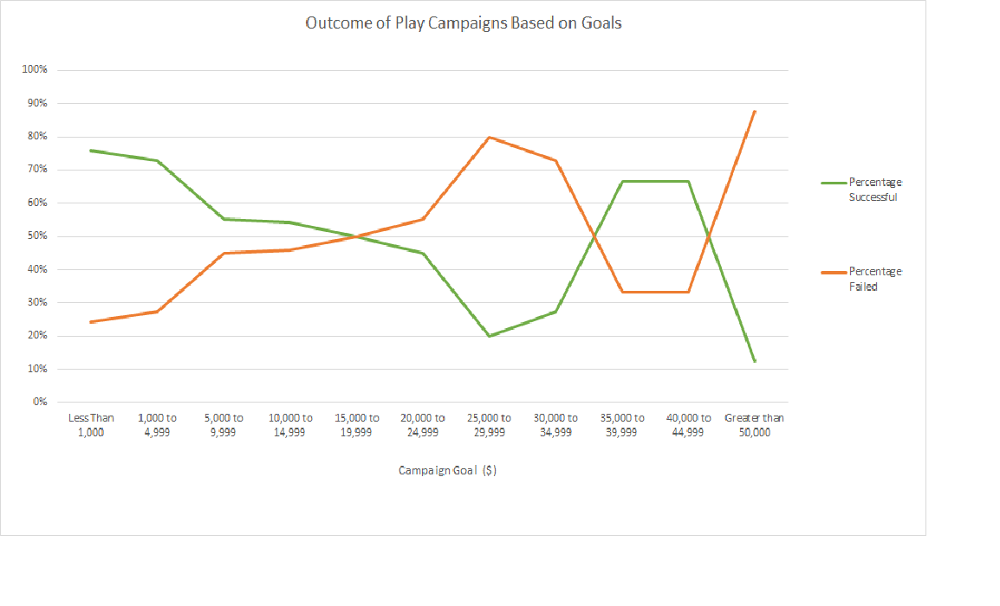

# kickstarter-analysis
Performing analysis on kickstarter data to uncover trends

## Overview of Project
Louise’s play *Fever* came close to its fundraising goal in a short amount of time. Now, she wants to know how different campaigns fared in relation to their launch dates and their funding goals.

## Analysis and Challenges
The main challenge with exploring this dataset was formating the lanched_at variable. In it's raw format, it is a ten digit timestamp that is difficult to understand. As it is the timestamp shows total seconds that have passed since the epoch, which is January 1, 1970 in Unix. I had to convert the date to a more readible format using this code:

              date_created =(((launched_at/60)/60)/24)+DATE(1970,1,1)

This formula is dividing the total time first by 60 seconds to get the number of minutes, then 60 minutes to get the number of hours, then 24 hours to get how many days after the epoch this campaign was launched. The DATE function puts the data in a readible format. The result is data of the format: 6/22/15 0:10.

We want to categorize the data in order to draw out trends. In their own columns, I isolated both the Month and Year for each data point. To get the Year, I just created a new column and used the year function"

              year=YEAR(date_created)
Since Excel dates are serial numbers in their nature it can be difficult use in pivot tables, so I used the Excel TEXT function convert them to text values. I created a new column for this string variable and used the formula:
              date_created_text=TEXT(date_created,"mm/dd/yy h:mm")

## Results

